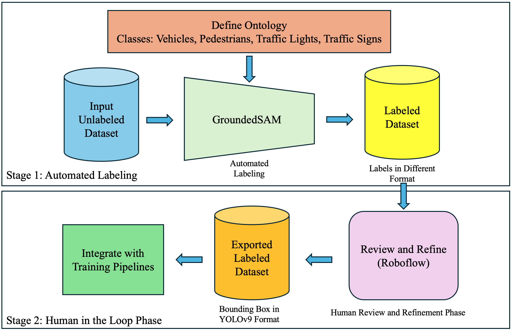

# Studienarbeit Title: YOLO-Based Real-Time Object Detection for Autonomous Driving in CARLA
- **Author**: Suraj Bhardwaj
- **Institution**: University of Siegen, Faculty of Electrical Engineering and Computer Science
- **Program**: Master of Science (M.Sc.) in International Graduate Studies in Mechatronics
- **Supervisor 1**: Prof. Dr.-Ing. Roman Obermaisser (Chair for Embedded Systems Department, University of Siegen)
- **Supervisor 2**: Dongchen Li M.Sc. (Doctoral Researcher at Embedded Systems Department, University of Siegen)

---

## Table of Contents
- [Objectives](#objectives)
- [Repository Structure](#repository-structure)
- [Installation](#installation)
- [Experiments Overview](#experiments-overview)
- [Achievements](#achievements)
- [License](#license)

---

## Objectives

The aim of this research project was to achieve the following objectives:
- **Simulation Setup:** Develop a detailed simulation of a Tesla Model 3 equipped with 8 cameras, 12 ultrasonic sensors, and 1 radar. Establish a pipeline for collecting and storing sensor data from this configuration.

    
    

- **Dataset Creation:** Generate a synthetic image dataset from the recorded camera data captured by the Tesla Model 3’s camera sensors.
- **YOLO Training:** Train YOLO object detection models YOLOv8, YOLOv9, YOLOv10, and YOLO11 on the custom synthetic dataset and compare their performance.
- **Real-Time Integration:** Integrate one of the best-performing YOLO models based on highest localization precision and classification accuracy into the CARLA simulator to enable real-time object detection within the simulation environment.


## Repository Structure

The repository is organized as follows:

```bash
|-- dataops/        # Metadata for the project
|   |-- data_organisation.py          # Python module to reorganise the images in a defined naming convention
|   |-- data_preparation.ipynb    # Notebook for basic operations on the collected data
|   |-- main_autodistill_carla_labeling.ipynb  # Notebook for automated labeling using GroundedSAM
|-- figures/        # Directory for images used in this README file
|   |-- 11_Class_Diagram.png  # An example
|-- simulation/                    # Directory containing simulation related code
|   |   |-- checkpoints/            # Directory for model checkpoints for inference
|   |   |   |-- YOLO11m/
|   |   |   |   |-- best.pt       # Checkpoint for inference     
|   |   |-- configs/              # Directory for sensor configurations
|   |   |   |-- camera_config.json
|   |   |   |-- radar_config.json
|   |   |   |-- ultrasonic_config.json
|   |-- Sensor_Base.py
|   |-- WeatherSelector.py
|   |-- YOLO_inference.py
|   |-- carla_world.py
|   |-- main.py
|   |-- sensor_data_processor.py
|   |-- set_synchronous_mode.py
|   |-- settings.py
|   |-- spawn_npc.py        
|-- training/      
|   |-- Version_5_exp/    # Source code for model training
|   |   |-- EDA/eda_version_5.ipynb          # Exploratory Data Analysis (EDA) on the custom dataset
|   |   |-- YOLO_11/          # Code for training YOLO11 models
|   |   |   |-- v11_m/
|   |   |   |   |-- runs/detect/val # Inference results of test dataset
|   |   |   |   |-- train/
|   |   |   |   |   |-- weights/best.pt # Directory for storing checkpoints during model training
|   |   |   |   |   |-- results.csv # Results of model training
|   |   |   |   |-- Y_v_11_m_ultralytics.ipynb # Notebook containing YOLO11m training code
|   |   |   |-- v11_n/
|   |   |   |   |-- runs/detect/val
|   |   |   |   |-- train/
|   |   |   |   |   |-- weights/best.pt
|   |   |   |   |   |-- results.csv
|   |   |   |   |-- Y_v_11_n_ultralytics.ipynb
|   |   |   |-- v11_s/
|   |   |   |   |-- runs/detect/val
|   |   |   |   |-- train/
|   |   |   |   |   |-- weights/best.pt
|   |   |   |   |   |-- results.csv
|   |   |   |   |-- Y_v_11_s_ultralytics.ipynb
|   |   |-- YOLO_v10/  # Directory for YOLOv10 model training and evaluation with similar structure as depicted for YOLO11
|   |   |-- YOLO_v8/  
|   |   |-- YOLO_v9/        
|   |   |-- dataset.ipynb  # Notebook showing code to download dataset after manual-review and refinement phase from Roboflow
|   |   |-- evaluation.ipynb       # Notebook containing code for best epoch
|   |-- requirements.yaml      # Yaml file for "yolov_env" conda environment
|-- SB_Studienarbeit.pdf  # PDF of the full report
|-- .gitignore                   # Files to ignore during version control
|-- README.md                    # This file
```

---

## Installation

To reproduce the experiments or run any part of this codebase, follow the steps given below:

### Clone the repository:
```bash
git clone https://github.com/SurajBhar/studienarbeit_repository.git
cd studienarbeit_repository
```
### Install Dependencies based on the Project Phase:
This project is divided the into following four phases:
- **Phase A: CARLA Simulation:** The simulation tasks, including data collection and real-time inference, were executed using CARLA version 0.9.13 on an Ubuntu 20.04.6 LTS system. The hardware setup included a single NVIDIA GPU with 8 GB of memory, sufficient for running simulations and YOLO model inferences. Python 3.10 was chosen for its extensive support for deep learning libraries. 

    1. Depending upon your preference, you can create a conda environment and install following packages or you can install them without a conda virtual environment on your system.

        - Key libraries and frameworks used are:
            - OpenCV (v4.9.0) for video processing and visualization.
            - NumPy (v1.26.2) for numerical operations.
            - Pandas (v2.1.4) for data handling.
            - Matplotlib (v3.10.0) for visualization.
            - PyTorch (v2.2.0) and Torchvision (v0.17.0) for deep learning, with CUDA acceleration (v11.8).
            - Ultralytics (v8.3.55) for YOLO model operations.

    
    2. Follow following steps after installing dependencies or creating a conda virtual environment:
        ```bash
        cd simulation
        conda activate environment_name # Only if you have created a conda virtual environment
        ./CarlaUE4.sh # Launch CARLA simulator in standalone mode with default settings
        python main.py collect # For Data Collection
        python main.py infer --duration 60  # To Run inference for 60 seconds
        ```
    3. Data Collection:
        ```bash
        ./CarlaUE4.sh # Launch CARLA simulator in standalone mode with default settings
        python main.py collect # For Data Collection
        ```
    4. YOLO Inference:
        ```bash
        ./CarlaUE4.sh # Launch CARLA simulator in standalone mode with default settings
        python main.py infer --duration 60  # To Run inference for 60 seconds
        ```

- **Phase B: Data Preprocessing and Automated Labeling:** In Phase B, we have performed basic preprocessing operations on collected sensor data and used a L4 GPU provided by google colab pro for automated labeling using GroundedSAM.
    1. Use "yolov_env" or Python 3.10 or greater version for data reorganisation.
    2. Follow the "main_autodistill_carla_labeling.ipynb" notebook step by step for automated labeling. It includes installation of required packages. You don't need to create a seperate environment for this.
    
- **Phase C: Manual review and refinement:** Here we have utilised the roboflow tool for annotation review and refinement and to produce final version of the dataset. 
    1. Go to Roboflow and create an account. Link: (https://roboflow.com/)
    2. Upload your labeled dataset after labeling it using GroundedSAM.
    3. Manually review each generated label and correct it if necessary.
    4. Depending upon your final task convert the bounding boxes into desired format.
- **Phase D: EDA and Model Training:** In Phase D, we have performed EDA and  Model training. Follow following steps to replicate eda and model training. The dataset is not provided in this repository. You can use your own custom dataset for your research.

    1. Create a conda virtual environment:
        ```bash
        cd training
        conda env create -f requirements.yml
        conda activate yolov_env
        ```
    2. You can run each code cell in the python notebook in respective model directory to train YOLO models using ultralytics and yolov_env conda environment.

---

## Achievements
1. **Autonomous Simulation Environment:** Developed a realistic Tesla Model 3 simulation in CARLA, including dynamic environmental interactions such as NPC vehicles, pedestrians, and variable weather conditions.


2. **Robust Data Collection:** Generated high-quality synthetic image dataset for 2D object detection, utilizing synchronized sensor outputs.


- Two-Stage Dataset Labeling Process: The figure below details each step in the dataset labeling workflow. In the first stage, it shows the preparation of unlabeled input data, definition of class ontologies, configuration of the GroundedSAM model according to these ontologies, and the automated generation of preliminary labels through advanced object detection and segmentation. The second stage illustrates the manual review and refinement process using the Roboflow framework, where labels generated by GroundedSAM are meticulously adjusted to ensure they conform to the precise bounding box format necessary for model specific training for example YOLOv9 format required for training YOLOv9 models for 2D object detection task.

3. **Machine Learning Integration:** Successfully trained and evaluated YOLO models (YOLOv8, YOLOv9, YOLOv10, and YOLO11) on the custom dataset and integrated the best performing YOLO models in the CARLA simulation, enabling real-time inference at 30 FPS.

4. **Visual Output:** Enhanced object detection workflows by incorporating grid-based visualization and video recording for performance evaluation.


---

## License

This repository is licensed under the [MIT License](https://opensource.org/licenses/MIT) - feel free to modify and distribute the code with proper attribution.
